# WINE DINING : 와인 입문자들을 위한 개인화된 와인 추천 서비스

 > 와인 입문자들에게 개인 취향에 맞는 와인을 추천하고, 상세 정보와 어울리는 음식을 제공하여 맞춤형 와인 경험을 선사하는 서비스 **WINE DINING(와인 다이닝)** 입니다.


<br/>

# 📌 목차

### 1️⃣ [팀원 소개](#1-팀원-소개)
### 2️⃣ [서비스 소개](#2-서비스-소개)
### 3️⃣ [서비스 화면](#3-서비스-화면)
### 4️⃣ [개발 환경](#4-개발-환경)
### 5️⃣ [기술 특이점](#5-기술-특이점)
### 6️⃣ [기획 및 설계 산출물](#6-기획-및-설계-산출물)
### 7️⃣ [Conventions](#7-conventions)
### 8️⃣ [개발 회고](#8-개발-회고)

<br/>

# 1. 팀원 소개

&nbsp;

## 💞 팀원 소개

<table>
    <tr>
        <td height="140px" align="center"> <a href="https://github.com/[github-id]">
             <br><br> 👑 정다인 <br>(Team Leader, Front-End) </a> <br></td>
        <td height="140px" align="center"> <a href="https://github.com/kwo9827">
             <br><br> 👶🏻 오승열 <br>(Front-End Leader) </a> <br></td>
        <td height="140px" align="center"> <a href="https://github.com/[github-id]">
             <br><br> 👶🏻 류현 <br>(Front-End) </a> <br></td>
        <td height="140px" align="center"> <a href="https://github.com/[github-id]">
             <br><br> 👶🏻 신동운 <br>(Back-End, Infra) </a> <br></td>
        <td height="140px" align="center"> <a href="https://github.com/dwshin-dev">
             <br><br> 👶🏻 나유빈 <br>(AI, Data) </a> <br></td>
    </tr>
    <tr>
         <td>
            - 프로젝트 총괄
            <br/>
            - 픽셀 디자인 구현
            <br/>
            - GA 연동 및 데이터 분석
            <br/>
            - 사용자 경험 최적화
         </td>
         <td>
            - 프론트엔드 개발 총괄
            <br/>
            - 와인 셀러 기능 개발
            <br/>
            - 검색 기능 구현
            <br/>
            - 와인 상세 페이지 개발
         </td>
         <td>
            - UI/UX 디자인
            <br />
            - AI 프롬프팅 디자인
            <br/>
            - 반응형 웹 구현
            <br/>
            - 와인 MBTI 알고리즘 구현
            <br/>
            - 와인 취향 테스트 구현
         </td>
         <td>
            - API 설계 및 구현
            <br/>
            - 서비스 아키텍처 설계
            <br/>
            - CI/CD 파이프라인 구축
            <br/>
            - AWS 인프라 관리
            <br/>
            - 데이터베이스 설계 및 관리리
         </td>
         <td>
            - 와인 데이터 크롤링 및 전처리
            <br/>
            - K-means 클러스터링 구현
            <br/>
            - 콘텐츠 기반 필터링 개발
            <br/>
            - 추천 알고리즘 개발
            <br/>
            - 와인 데이터베이스 설계 및 관리
         </td>
    </tr>
</table>

&nbsp;

# 2. 서비스 소개

WINE DINING(와인 다이닝)은 와인 입문자들을 위한 개인화된 와인 추천 서비스입니다.      
와인 초보자들의 인터뷰를 통해 **다양한 와인 종류, 높은 가격대, 개인 취향 반영의 어려움**을 해결하는 서비스를 제공합니다.

&nbsp;

## 📆 프로젝트 기간  
### 2025.02.24 ~ 2025.04.11

- **기획 및 설계**: 2025.02.24 ~ 2025.03.14  
- **프로젝트 구현**: 2025.03.15 ~ 2025.04.04  
- **버그 수정 및 산출물 정리**: 2025.04.05 ~ 2025.04.14 
- **코드 리팩토링**: 2025.04.05 ~  

&nbsp;

## 🚀 주요 기능

### ✅ 와인 취향 테스트 (WINE TEST)  
- **개인 취향 분석**: 와인에 대한 선호도를 분석하여 맞춤형 와인 추천  
- **와인 MBTI 테스트**: 재미있는 방식으로 자신과 어울리는 와인 유형 확인  
- **초보자 친화적 UI**: 와인에 대한 심리적 장벽을 낮춘 픽셀 디자인 적용  

### ✅ 개인화된 와인 추천  
- **취향 기반 추천**: 사용자 취향 테스트 결과 기반 맞춤형 와인 추천  
- **와인 기록 기반 추천**: 사용자가 평가한 와인 정보를 활용한 추천  
- **위시리스트 기반 추천**: 사용자의 관심 와인을 분석한 추천  

### ✅ 나만의 와인 셀러 (WINE CELLAR)  
- **와인 기록 관리**: 마신 와인의 정보와 경험을 기록  
- **커스텀 와인 등록**: 데이터베이스에 없는 와인도 직접 등록 가능  
- **BEST 와인 선정**: 가장 좋았던 와인 TOP 3 등록 및 관리  

&nbsp;

## 🔧 기술 스택  

### **프론트엔드**
- React
- TypeScript
- Axios

### **백엔드**
- Spring Boot
- Spring Data JPA
- Spring Security
- JWT
- PostgreSQL

### **데이터 분석 및 AI**
- Fast API
- Python
- scikit-learn
- K-means 클러스터링

### **CI/CD 및 서버**
- AWS EC2
- Docker
- Jenkins
- Nginx

&nbsp;

## 🛠️ 개발 환경

- Frontend
    - Visual Studio Code `1.97.2`
    - HTML5, CSS3, Javascript(ES6)
    - React `18.3.0`
    - Nodejs `20`
- Backend
    - Intellij `2025.1.6`
    - Oracle Open JDK `17`
    - JWT
    - SpringBoot `3.3.7`
        - JAVA Spring Data JPA `3.1`
        - Spring Security `6.4.2`
    - Gradle `8.12.1`
- CI/CD
    - AWS EC2
        - NGINX `1.27.4`
        - Ubuntu `24.04.1 LTS`
        - Docker `27.5.1`
        - Jenkins `2.496`
- Database
    - MySQL `8.0.41`
    - Redis `7.4.2`
    - S3

&nbsp;

## 🧠 추천 알고리즘 활용

### 콘텐츠 기반 필터링 시스템
 - 와인 데이터의 특성(당도, 산도, 바디감, 타닌 등)을 분석
 - 사용자 취향 테스트 결과와 가장 유사한 특성을 가진 와인 추천
 - 콜드 스타트 문제 해결을 위한 데이터 기반 접근

### K-means 클러스터링
 - 37,000여 개의 와인을 특성에 따라 37개 클러스터로 분류
 - 사용자가 선호한 와인이 속한 클러스터에서 유사한 와인 추천
 - 사용자 기록 데이터 기반 정확한 추천 제공
 
&nbsp;

## 📌 기대 효과  

✅ **와인 입문자**: 개인 취향에 맞는 와인을 쉽게 찾고, 와인에 대한 진입 장벽 완화  
✅ **와인 마니아**: 새로운 와인 발견 및 체계적인 와인 기록 관리  
✅ **와인 산업**: 와인 시장 확대 및 다양한 와인에 대한 소비자 접근성 향상  

**WINE DINING은 당신의 첫 파인다이닝, 와인다이닝과 함께 시작합니다!**  

&nbsp;

# 3. 서비스 화면  


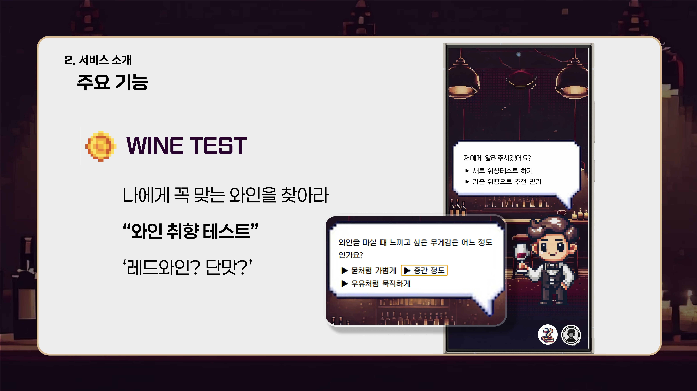
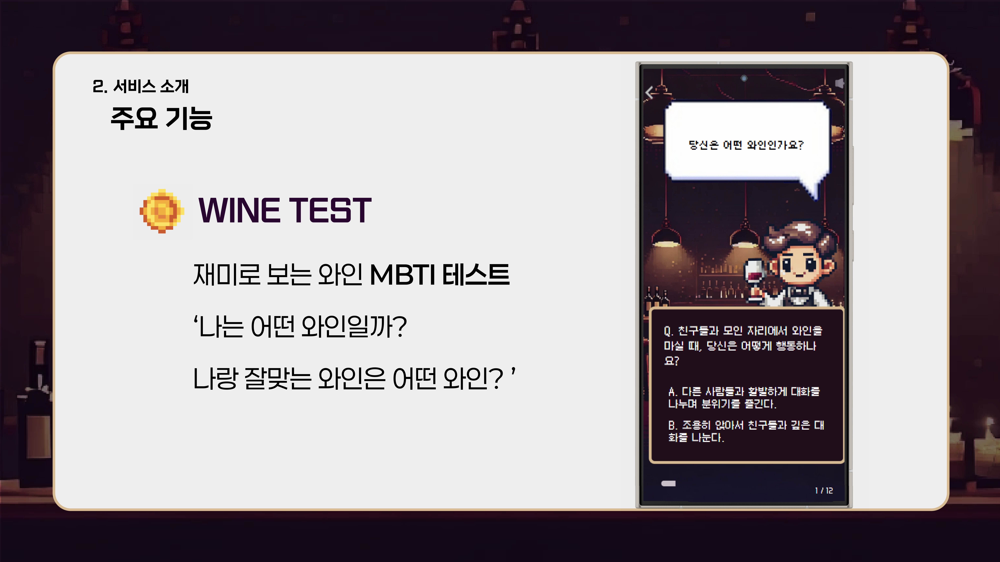
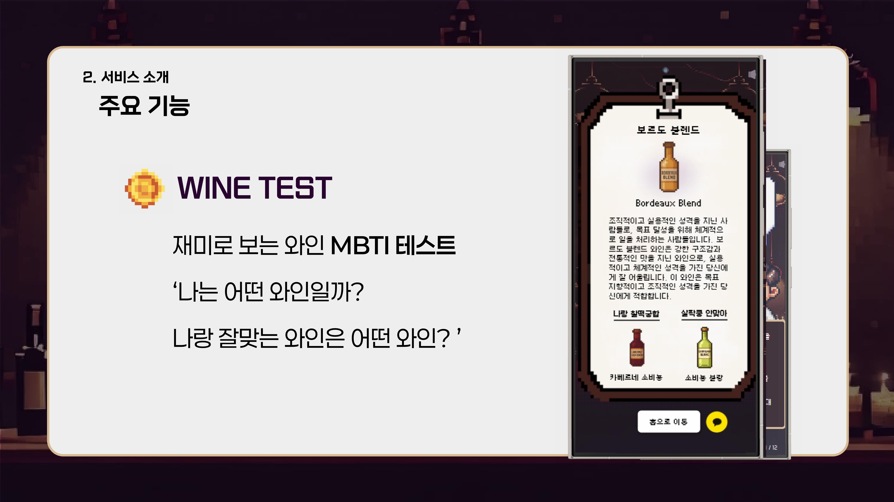

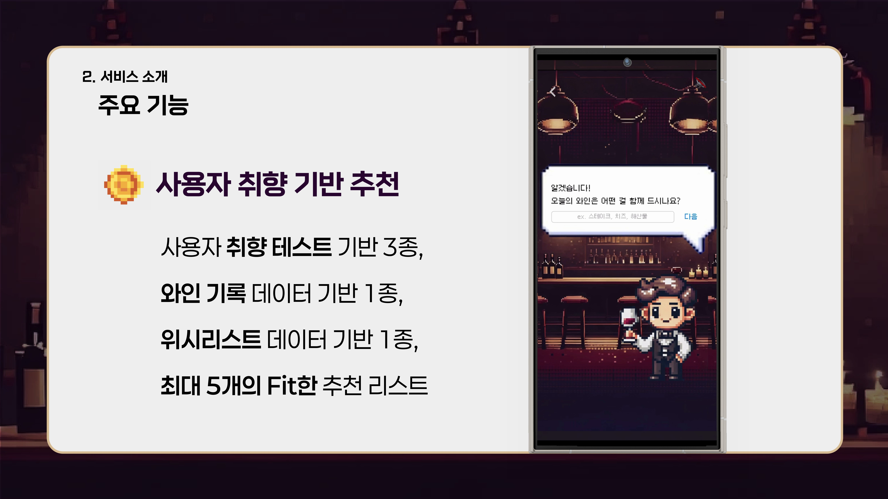
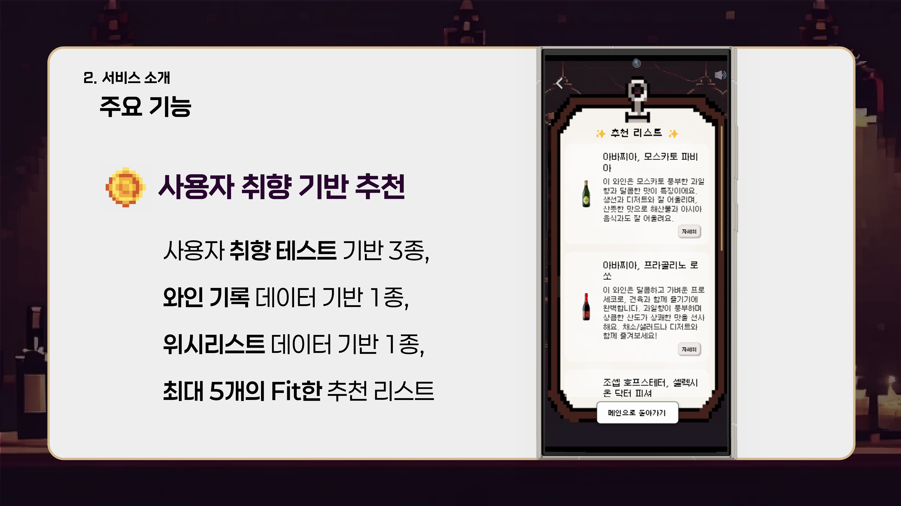
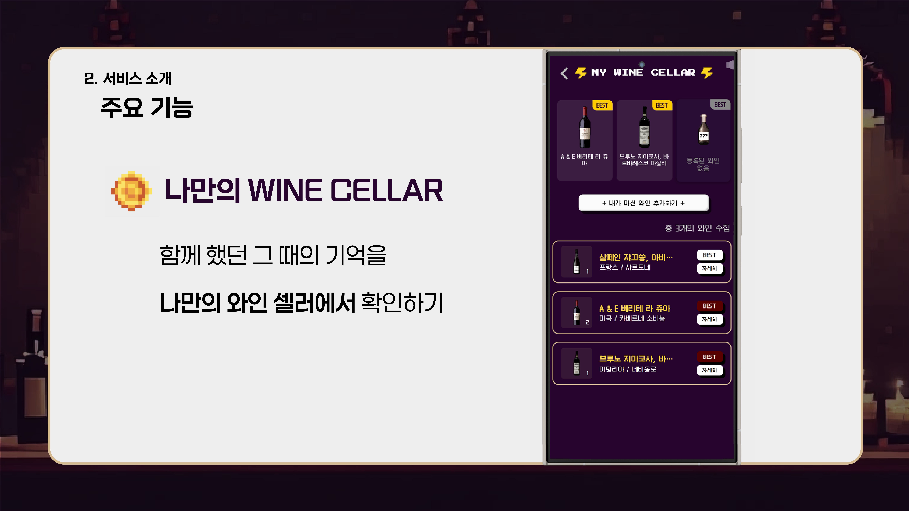
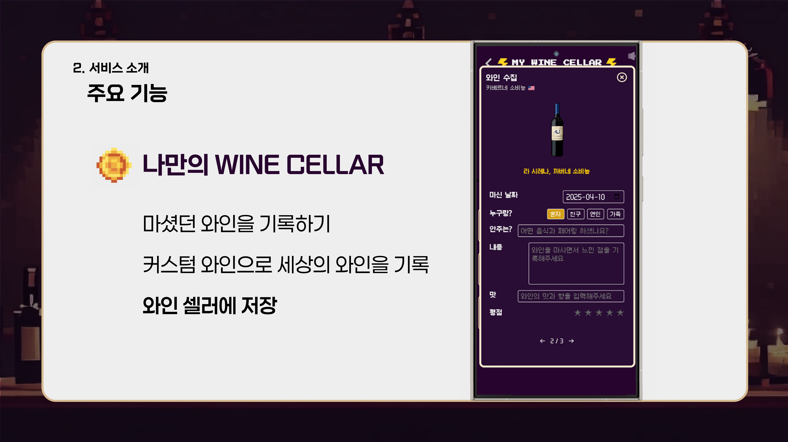
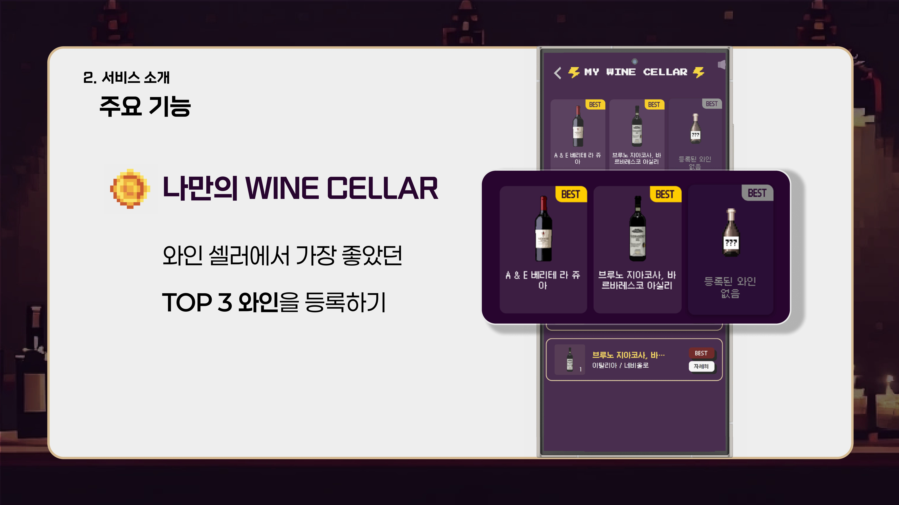

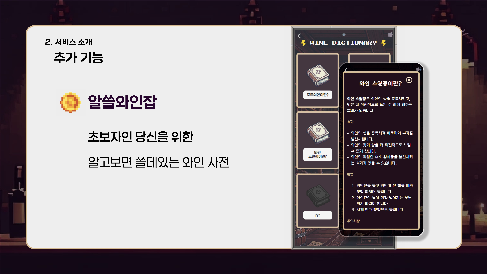

&nbsp;

# 4. 개발 환경  

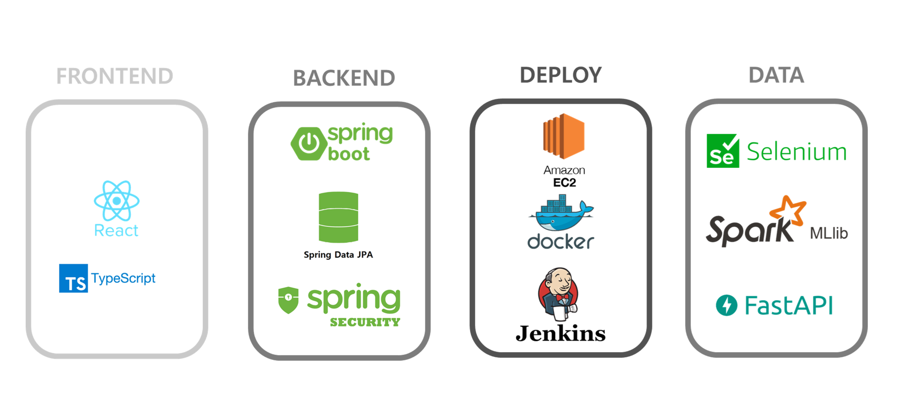
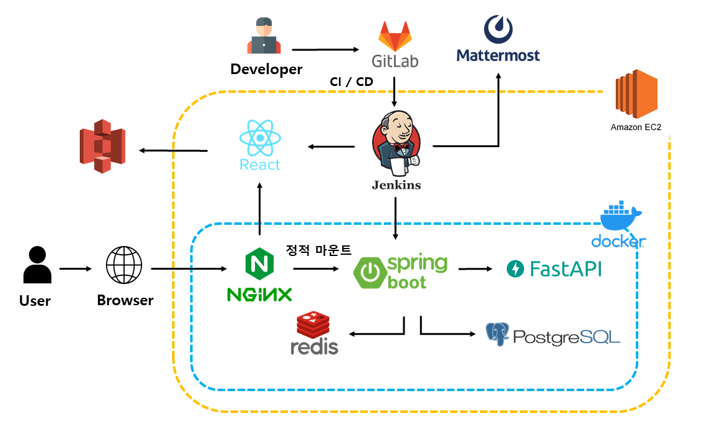

&nbsp;

# 5. 기술 특이점

&nbsp;

## ⭐ 프로젝트의 특장점 (기능 관점)
1. **37,000여 개의 방대한 와인 데이터베이스**  
   - 국내 최대 와인 정보 사이트의 데이터를 활용하여 다양한 와인 정보 제공  
   - 27,433개의 와인 이미지를 픽셀화하여 독특한 UI 경험 제공  

2. **개인화된 맞춤형 추천 시스템**  
   - 취향 테스트, 와인 기록, 위시리스트를 종합적으로 분석한 추천  
   - 초보자 친화적인 알고리즘으로 진입 장벽 낮춤  

3. **픽셀 디자인 UI**  
   - 레트로 게임 스타일의 UI로 와인의 딱딱한 이미지 개선  
   - 사용자 친화적인 디자인으로 흥미 유발  

4. **체계적인 와인 기록 관리**  
   - 마신 와인을 쉽게 기록하고 관리할 수 있는 기능  
   - 나만의 와인 셀러를 통한 와인 경험 축적  

&nbsp;

## 💡 프로젝트의 차별점 / 독창성 (기술 관점)
1. **최적화된 추천 알고리즘**  
   - K-means 클러스터링을 활용한 정확한 와인 추천  
   - 콘텐츠 기반 필터링으로 콜드 스타트 문제 해결  

2. **데이터 기반 서비스 개선**  
   - Google Analytics를 활용한 사용자 행동 분석  
   - 사용자 피드백과 데이터를 바탕으로 지속적인 UI/UX 개선  

3. **초보자 중심 설계**  
   - 와인 용어와 복잡한 정보를 쉽게 이해할 수 있는 UI  
   - 와인 입문자의 선호도(단맛 등)를 우선적으로 고려한 추천 시스템  

4. **확장 가능한 아키텍처**  
   - 미래의 기능 확장(카메라 인식, 소셜 공유 등)을 고려한 설계  
   - 대용량 데이터 처리를 위한 확장성 있는 인프라 구축  

&nbsp;

## 📡 주요 기술 및 데이터  
### **데이터 처리**  
- 37,410개 와인 데이터 수집 및 전처리  
- 27,433개 와인 이미지 픽셀화 처리  

### **추천 알고리즘**  
- 취향 테스트 기반 추천: 가격 필터링 + 당도 가중치  
- 위시리스트 기반 추천: 와인 데이터 평균치 벡터화  
- 와인 셀러 기반 추천: K-means 클러스터링(최적 K값 37)  

### **분석 도구**  
- Google Analytics: 사용자 행동 패턴 분석 및 개선점 도출  
- scikit-learn: 데이터 분석 및 클러스터링  

&nbsp;

# 6. 기획 및 설계 산출물  

### 기능 명세서 
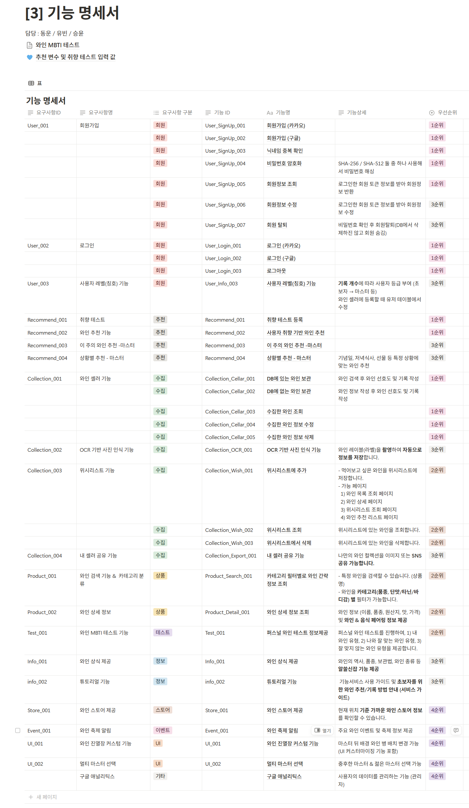

### 와이어 프레임 
https://www.figma.com/design/ichyUAgJEDEGZQYGQSOtKD/%EB%AA%A9%EC%97%85?node-id=51-1217&p=f&t=KHPAuvXjFpGY5BXM-0

### ERD 
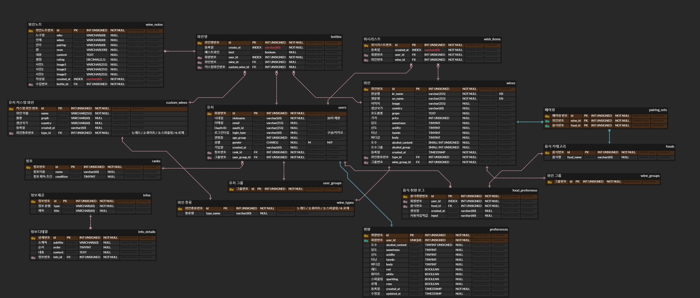

### API 문서
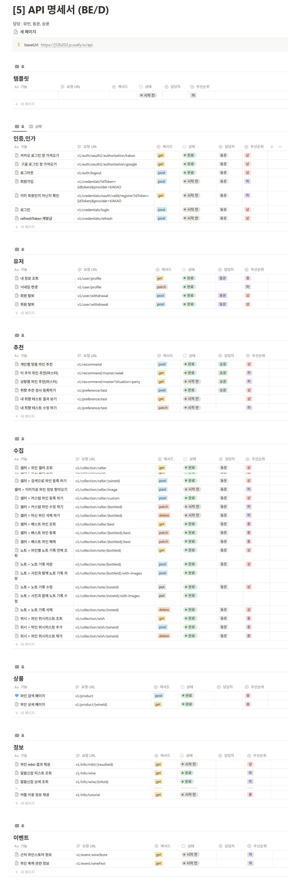

&nbsp;

# 7. Conventions  

### Commit Message Structure
- 기본적인 commit message 구조  
   ```
   type: subject
   ```
   - **type**: 어떤 의도로 커밋을 했는지 명시합니다. (ex. feat, refactor)
   - **Subject**: 코드 변경사항을 요약해서 작성합니다. 영문으로 표기하고 마침표는 찍지 않습니다.

### Commit Type  

| Tag Name | Description |
|----------|------------|
| feat | 새로운 기능 추가 |
| fix | 버그 수정 |
| docs | 문서 수정 |
| style | 코드 포맷팅, 코드 변경 없음 |
| refactor | 코드 리팩토링 |
| test | 테스트 코드 추가 |
| chore | 빌드 업무 수정, 패키지 매니저 수정 |
| remove | 파일 삭제 |
| rename | 파일 또는 디렉터리 이동/수정 |

&nbsp;

# 8. 개발 회고  

##### **정다인**<br>
- **소감 및 만족한 점**: 프로젝트 리더로서 팀을 이끌고 픽셀 디자인을 구현하는 과정이 매우 보람찼습니다. 특히 Google Analytics를 연동하여 사용자 행동 데이터를 분석하고 이를 바탕으로 UI/UX를 지속적으로 개선한 점이 가장 기억에 남습니다. 데이터 기반의 의사결정이 서비스 품질 향상에 큰 도움이 되었음을 체감할 수 있었습니다.
- **어려웠거나 아쉬웠던 점**: 픽셀 디자인 구현 과정에서 다양한 디바이스에서의 일관된 사용자 경험을 제공하는 것이 예상보다 어려웠습니다. 또한 GA 데이터를 더 심층적으로 분석하여 세부적인 서비스 개선에 활용하지 못한 점이 아쉽습니다.
- **다음 개발 때 시도해 볼 점**: 다음 프로젝트에서는 A/B 테스트를 도입하여 더 체계적인 사용자 경험 개선을 시도해보고 싶습니다. 또한 디자인 시스템을 더 체계적으로 구축하여 개발 효율성과 디자인 일관성을 높이고 싶습니다.

##### **오승열**<br>
- **소감 및 만족한 점**: 프론트엔드 리더로서 와인 셀러와 검색 기능을 개발하면서 사용자 중심의 인터페이스 설계의 중요성을 깊이 이해하게 되었습니다. 특히 와인 셀러 기능은 사용자가 자신의 와인 경험을 기록하고 관리할 수 있는 핵심 기능으로, 사용자 데이터 관리와 상태 관리에 많은 신경을 썼습니다. 와인 상세 페이지를 개발하면서 복잡한 와인 정보를 직관적으로 표현하는 방법에 대해 많이 고민했고, 이 과정에서 프론트엔드 개발 역량이 크게 향상되었습니다.
- **어려웠거나 아쉬웠던 점**: 와인 셀러 기능에서 다양한 와인 데이터를 효율적으로 관리하고 표시하는 것이 예상보다 복잡했습니다. 특히 데이터 로딩 과정에서의 성능 최적화와 사용자 인터페이스의 응답성 유지 사이에서 균형을 맞추는 것이 어려웠습니다. 또한 검색 기능의 필터링 옵션을 더 세분화하여 제공하지 못한 점이 아쉽습니다.
- **다음 개발 때 시도해 볼 점**: 다음 프로젝트에서는 상태 관리 라이브러리를 더 효율적으로 활용하여 복잡한 데이터 흐름을 체계적으로 관리하고 싶습니다. 또한 가상 스크롤링과 이미지 최적화 기법을 적용하여 대용량 데이터 처리 시 성능을 개선하고, 더 직관적이고 사용하기 쉬운 사용자 인터페이스를 설계하고 싶습니다.

##### **류현**<br>
- **소감 및 만족한 점**: UI/UX 디자인과 반응형 웹 구현을 담당하면서 사용자 친화적인 인터페이스 설계에 대한 이해를 넓힐 수 있었습니다. 와인 MBTI 알고리즘과 취향 테스트 구현을 통해 프론트엔드와 로직 구현을 결합하는 경험을 쌓을 수 있었고, 사용자들에게 재미와 실용성을 동시에 제공하는 기능을 만들 수 있어 보람찼습니다.
- **어려웠거나 아쉬웠던 점**: 반응형 웹 구현 과정에서 다양한 디바이스에 최적화하는 작업이 예상보다 복잡했습니다. 특히 와인 MBTI 테스트의 결과 화면을 여러 디바이스에서 일관되게 보여주는 것이 어려웠고, 이를 해결하기 위한 더 효율적인 방법을 찾지 못한 점이 아쉽습니다.
- **다음 개발 때 시도해 볼 점**: 다음 프로젝트에서는 초기 설계 단계에서 더 체계적인 반응형 전략을 수립하고, 컴포넌트 재사용성을 높이는 데 중점을 두고 싶습니다. 또한 사용자 인터랙션과 애니메이션 효과를 강화하여 더욱 몰입감 있는 UI/UX를 구현해보고 싶습니다.

##### **신동운**<br>
- **소감 및 만족한 점**: 백엔드 개발과 인프라 구축을 담당하면서 서비스의 전체 아키텍처를 설계하고 구현하는 경험을 할 수 있었습니다. API 설계부터 CI/CD 파이프라인 구축, AWS 인프라 관리까지 전반적인 백엔드 시스템을 구축하면서 기술적으로 많이 성장할 수 있었습니다. 특히 안정적인 배포 환경을 구축하고 데이터베이스를 효율적으로 설계하는 과정이 매우 유익했습니다.
- **어려웠거나 아쉬웠던 점**: 초기 아키텍처 설계 시 확장성을 충분히 고려하지 못해 서비스가 확장됨에 따라 일부 구조 변경이 필요했습니다. 또한 테스트 코드 작성에 충분한 시간을 투자하지 못한 점이 아쉽습니다.
- **다음 개발 때 시도해 볼 점**: 다음 프로젝트에서는 마이크로서비스 아키텍처를 도입하여 서비스의 확장성과 유지보수성을 높이고 싶습니다. 또한 TDD 방식을 적용하여 더 안정적인 코드 베이스를 구축하고 싶습니다.

##### **나유빈**<br>
- **소감 및 만족한 점**: AI와 데이터 분석을 담당하면서 실제 서비스에 데이터 기반 추천 시스템을 구현하는 값진 경험을 했습니다. 방대한 와인 데이터를 크롤링하고 전처리하는 과정부터 K-means 클러스터링과 콘텐츠 기반 필터링을 이용한 추천 알고리즘 개발까지, 데이터 사이언스 이론을 실제 서비스에 적용하는 모든 과정이 도전적이면서도 보람찼습니다. 특히 사용자의 취향을 정확히 반영한 추천 시스템을 구현했을 때 큰 성취감을 느꼈습니다.
- **어려웠거나 아쉬웠던 점**: 데이터 품질 문제가 예상보다 심각해 데이터 전처리에 많은 시간이 소요되었습니다. 또한 추천 알고리즘의 성능을 실시간으로 평가하고 개선하는 시스템을 구축하지 못한 점이 아쉽습니다.
- **다음 개발 때 시도해 볼 점**: 딥러닝 기반 추천 시스템을 도입하여 추천 정확도를 더 높이고 싶습니다. 또한 실시간 피드백을 반영하는 동적 추천 시스템과 A/B 테스트 프레임워크를 구축하여 지속적인 알고리즘 개선을 시도하고 싶습니다.
